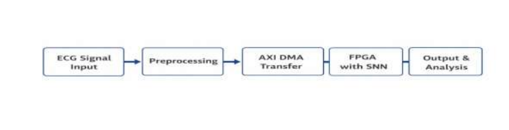
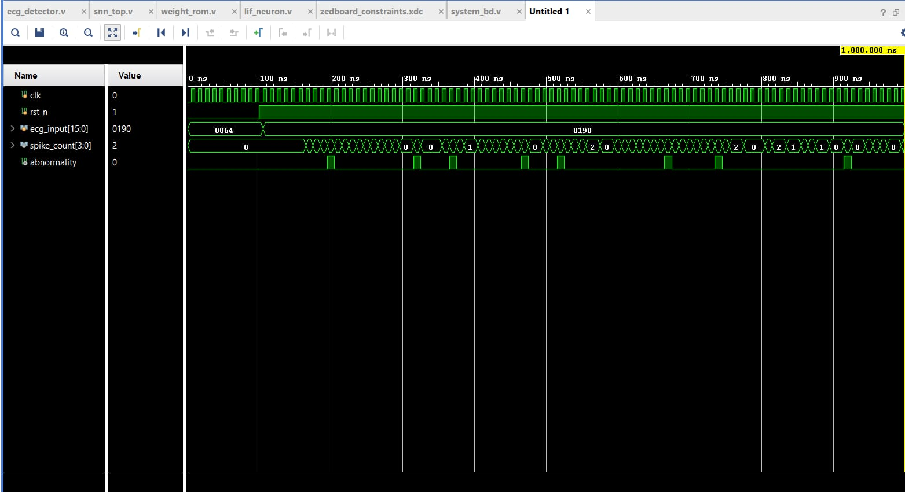
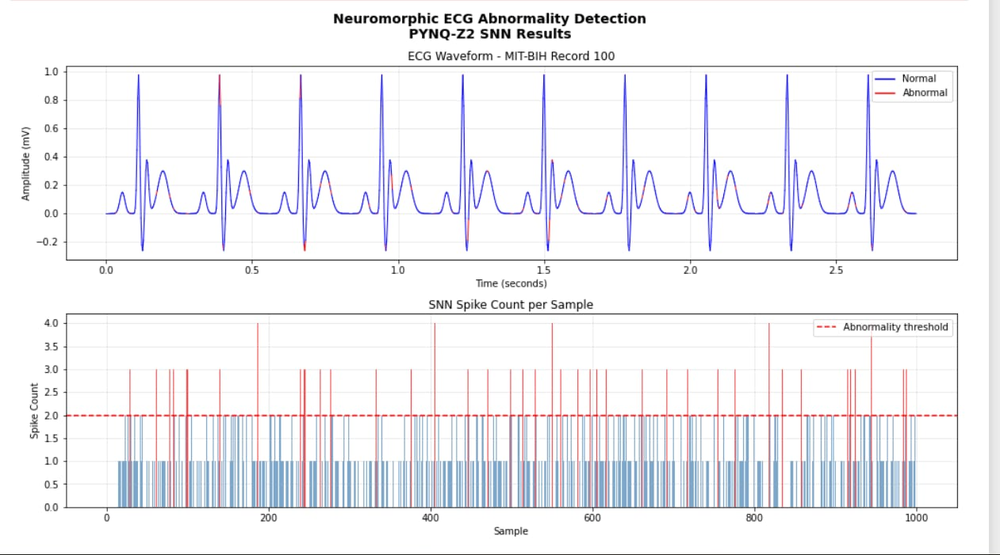
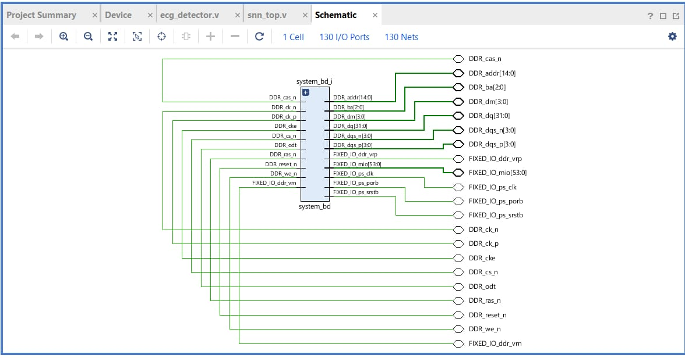

# Neuromorphic ECG Abnormality Detection Using FPGA

## Project Overview

This project implements a real-time ECG abnormality detection system using neuromorphic computing on an FPGA. The design processes ECG signals through a spike encoder and a Leaky Integrate-and-Fire (LIF) neuron model to detect abnormal cardiac activity. The implementation is written in Verilog HDL with the objective of achieving low-latency and energy-efficient processing suitable for embedded healthcare applications.

---

## Hardware Platform

- **FPGA Board:** PYNQ-Z2 (Xilinx Zynq-7020)
- **Programming Language:** Verilog HDL
- **Development Tool:** Xilinx Vivado
- **Dataset:** MIT-BIH Arrhythmia Database
- **Simulation:** Vivado Simulator

  ## Technologies Used

- Verilog HDL
- Xilinx Vivado
- PYNQ-Z2 FPGA
- Neuromorphic Computing
- Spiking Neural Networks (SNN)
- Leaky Integrate-and-Fire (LIF) Neuron
- MIT-BIH Arrhythmia Database
---


## Objectives

- Design a neuromorphic ECG abnormality detection system using Verilog HDL.
- Implement spike-based neural processing using a Leaky Integrate-and-Fire (LIF) neuron.
- Detect abnormal ECG patterns in real time.
- Demonstrate FPGA-based hardware acceleration for biomedical signal processing.

---

## System Architecture


```
ECG Signal
     │
     ▼
Spike Encoder
     │
     ▼
LIF Neuron
     │
     ▼
Abnormal Detector
     │
     ▼
Normal / Abnormal Output
```

---

## Repository Structure

```
Neuromorphic-ECG-Abnormality-Detection-FPGA
│
├── rtl/
│   ├── top_neuromorphic_ecg.v
│   ├── spike_encoder.v
│   ├── lif_neuron.v
│   └── abnormal_detector.v
│
├── simulation/
│   └── tb_ecg_reader.v
│
├── docs/
├── images/
├── results/
├── dataset/
└── README.md
```

---

## Hardware and Software

### Hardware
- FPGA Development Board
- ECG Signal Source
- AXI DMA Interface (planned architecture)

### Software
- Verilog HDL
- Xilinx Vivado
- Vivado Simulator / ModelSim

---

## Module Description

### Spike Encoder
Converts ECG samples into spike events based on a predefined threshold.

### LIF Neuron
Implements the Leaky Integrate-and-Fire neuron model for spike-based neural computation.

### Abnormal Detector
Monitors neuron firing activity over a predefined observation window and classifies the ECG signal as normal or abnormal.

### Top Module
Integrates all modules into a complete ECG abnormality detection system.

---

## Working Principle

1. ECG samples are provided as input.
2. The spike encoder converts ECG values into binary spike events.
3. The LIF neuron integrates incoming spikes and generates output spikes.
4. The abnormal detector analyzes neuron firing activity within a fixed time window.
5. The system classifies the ECG signal as either normal or abnormal.

---

## Applications

- Real-time cardiac monitoring
- Wearable healthcare devices
- Intelligent biomedical signal processing
- FPGA-based edge AI systems

---
---

## Results

### Simulation Waveform

The simulation waveform verifies the functionality of the neuromorphic ECG abnormality detection hardware by illustrating the clock, ECG input, spike generation, and abnormality detection signals.



---

### ECG Detection Results

The ECG detection results demonstrate the classification of normal and abnormal ECG samples using the implemented Spiking Neural Network (SNN). The spike count is compared against a predefined threshold to identify abnormal cardiac activity.



---

### RTL Schematic

The RTL schematic generated in Vivado represents the synthesized hardware architecture of the neuromorphic ECG abnormality detection system implemented on the FPGA.



## Future Enhancements

- Multiple parallel LIF neurons
- Weight ROM integration
- AXI DMA-based high-speed data transfer
- MIT-BIH Arrhythmia Database validation
- Hardware optimization for portable healthcare devices

---

## Author

**Busetty Geethika**

B.Tech in Electronics and Communication Engineering

BVRIT Narsapur
